Reading in the data

    library(dplyr)

    ## 
    ## Attaching package: 'dplyr'

    ## The following objects are masked from 'package:stats':
    ## 
    ##     filter, lag

    ## The following objects are masked from 'package:base':
    ## 
    ##     intersect, setdiff, setequal, union

    library(Seurat)
    library(patchwork)
    library(ggplot2)
    library(cowplot)

    ## 
    ## Attaching package: 'cowplot'

    ## The following object is masked from 'package:patchwork':
    ## 
    ##     align_plots

    # Here 'ie' stands for intestinal epithelium
    ie1.data <- Read10X(data.dir = "~/Desktop/study/R/ie/GSM2836573/")
    ie2.data <- Read10X(data.dir = "~/Desktop/study/R/ie/GSM2836574/")
    ie3.data <- Read10X(data.dir = "~/Desktop/study/R/ie/GSM2836575/")
    ie4.data <- Read10X(data.dir = "~/Desktop/study/R/ie/GSM2836576/")
    ie5.data <- Read10X(data.dir = "~/Desktop/study/R/ie/GSM2836577/")
    ie6.data <- Read10X(data.dir = "~/Desktop/study/R/ie/GSM2836578/")
    ie1 <- CreateSeuratObject(counts = ie1.data, project = "Duo_M1", min.cells = 20, min.features = 0)

    ## Warning: Feature names cannot have underscores ('_'), replacing with dashes
    ## ('-')

    ie2 <- CreateSeuratObject(counts = ie2.data, project = "Duo_M2", min.cells = 20, min.features = 0)

    ## Warning: Feature names cannot have underscores ('_'), replacing with dashes
    ## ('-')

    ie3 <- CreateSeuratObject(counts = ie3.data, project = "Jej_M1", min.cells = 20, min.features = 0)

    ## Warning: Feature names cannot have underscores ('_'), replacing with dashes
    ## ('-')

    ie4 <- CreateSeuratObject(counts = ie4.data, project = "Jej_M2", min.cells = 20, min.features = 0)

    ## Warning: Feature names cannot have underscores ('_'), replacing with dashes
    ## ('-')

    ie5 <- CreateSeuratObject(counts = ie5.data, project = "Il_M1", min.cells = 20, min.features = 0)

    ## Warning: Feature names cannot have underscores ('_'), replacing with dashes
    ## ('-')

    ie6 <- CreateSeuratObject(counts = ie6.data, project = "Il_M2", min.cells = 20, min.features = 0)

    ## Warning: Feature names cannot have underscores ('_'), replacing with dashes
    ## ('-')

    ie <- merge(ie1, y = c(ie2, ie3, ie4, ie5, ie6), add.cell.ids = c("Duo_M1", "Duo_M2", "Jej_M1", "Jej_M2", "Il_M1", "Il_M2"), project = 'all')
    ie

    ## An object of class Seurat 
    ## 11271 features across 13353 samples within 1 assay 
    ## Active assay: RNA (11271 features, 0 variable features)

    head(colnames(ie))

    ## [1] "Duo_M1_AAACATACAGCGGA-1" "Duo_M1_AAACATACCTTACT-1"
    ## [3] "Duo_M1_AAACATACTTTGCT-1" "Duo_M1_AAACCGTGCAGTCA-1"
    ## [5] "Duo_M1_AAACGCTGCAGTCA-1" "Duo_M1_AAACGCTGCGTGAT-1"

    table(ie$orig.ident)

    ## 
    ## Duo_M1 Duo_M2  Il_M1  Il_M2 Jej_M1 Jej_M2 
    ##   2348   2206   2466   1837   1828   2668

    ie[["percent.mt"]] <- PercentageFeatureSet(ie, pattern = "^mm10-mt-")
    VlnPlot(ie, features = c("nFeature_RNA", "nCount_RNA", "percent.mt"), ncol = 3, pt.size = 0.5)

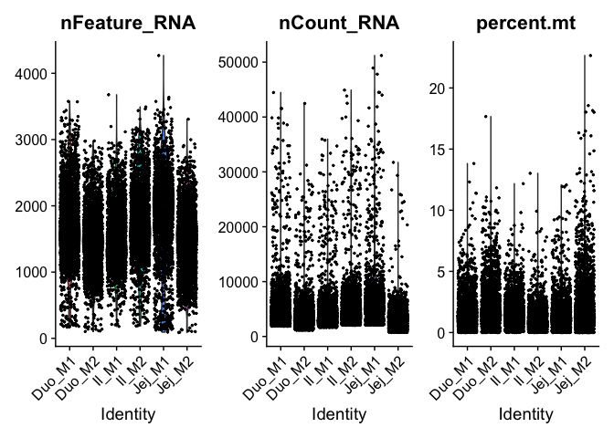

    plot1 <- FeatureScatter(ie, feature1 = "nCount_RNA", feature2 = "percent.mt") + theme(axis.text.x = element_text(angle = 90))
    plot2 <- FeatureScatter(ie, feature1 = "nCount_RNA", feature2 = "nFeature_RNA") + theme(axis.text.x = element_text(angle = 90))
    plot1 + plot2

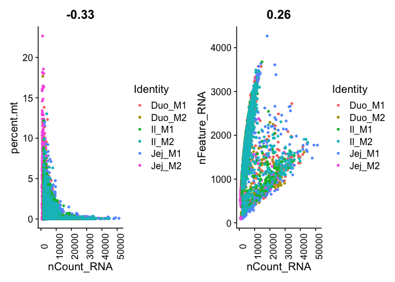

Filtering (using the same parameters in scRNA\_practice.ipynb)

    ie <- subset(ie, subset = nFeature_RNA >= 700 & nCount_RNA >= 1500 & nCount_RNA <= 40000 & percent.mt < 20)

Dimensional reduction without batch correction

    ie <- NormalizeData(ie, normalization.method = "LogNormalize", scale.factor = 10000)
    ie <- FindVariableFeatures(ie, selection.method = "vst", nfeatures = 2000)
    ie <- ScaleData(object = ie, verbose = FALSE)
    ie <- RunPCA(object = ie, npcs = 50, verbose = FALSE)
    ie <- RunUMAP(object = ie, reduction = "pca", dims = 1:50)

    ## Warning: The default method for RunUMAP has changed from calling Python UMAP via reticulate to the R-native UWOT using the cosine metric
    ## To use Python UMAP via reticulate, set umap.method to 'umap-learn' and metric to 'correlation'
    ## This message will be shown once per session

    ## 22:38:46 UMAP embedding parameters a = 0.9922 b = 1.112

    ## 22:38:46 Read 12445 rows and found 50 numeric columns

    ## 22:38:46 Using Annoy for neighbor search, n_neighbors = 30

    ## 22:38:46 Building Annoy index with metric = cosine, n_trees = 50

    ## 0%   10   20   30   40   50   60   70   80   90   100%

    ## [----|----|----|----|----|----|----|----|----|----|

    ## **************************************************|
    ## 22:38:49 Writing NN index file to temp file /var/folders/r6/kxpmf59n6ln32s10vrjrpfkh0000gn/T//RtmpSKHrQi/file101bc6870184e
    ## 22:38:49 Searching Annoy index using 1 thread, search_k = 3000
    ## 22:38:55 Annoy recall = 100%
    ## 22:38:55 Commencing smooth kNN distance calibration using 1 thread
    ## 22:38:57 Initializing from normalized Laplacian + noise
    ## 22:38:58 Commencing optimization for 200 epochs, with 556108 positive edges
    ## 22:39:11 Optimization finished

    p1 <- DimPlot(object = ie, reduction = "umap", group.by = "orig.ident")
    plot_grid(p1)

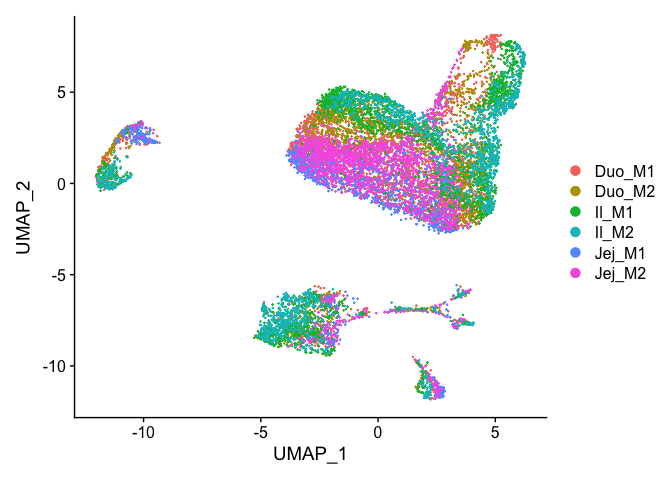
As can be seen, the batches are not well mixed.

Batch correction

    ie.list <- SplitObject(object = ie, split.by = "orig.ident")
    for (i in 1:length(x = ie.list)) {
        ie.list[[i]] <- NormalizeData(object = ie.list[[i]], verbose = FALSE)
        ie.list[[i]] <- FindVariableFeatures(object = ie.list[[i]], selection.method = "vst", nfeatures = 2000, verbose = FALSE)
    }
    reference.list <- ie.list[c("Duo_M1", "Duo_M2", "Jej_M1", "Jej_M2", "Il_M1", "Il_M2")]
    ie.anchors <- FindIntegrationAnchors(object.list = reference.list, dims = 1:50)

    ## Computing 2000 integration features

    ## Scaling features for provided objects

    ## Finding all pairwise anchors

    ## Running CCA

    ## Merging objects

    ## Finding neighborhoods

    ## Finding anchors

    ##  Found 6751 anchors

    ## Filtering anchors

    ##  Retained 3356 anchors

    ## Running CCA

    ## Merging objects

    ## Finding neighborhoods

    ## Finding anchors

    ##  Found 6065 anchors

    ## Filtering anchors

    ##  Retained 3023 anchors

    ## Running CCA

    ## Merging objects

    ## Finding neighborhoods

    ## Finding anchors

    ##  Found 5804 anchors

    ## Filtering anchors

    ##  Retained 2709 anchors

    ## Running CCA

    ## Merging objects

    ## Finding neighborhoods

    ## Finding anchors

    ##  Found 7408 anchors

    ## Filtering anchors

    ##  Retained 3121 anchors

    ## Running CCA

    ## Merging objects

    ## Finding neighborhoods

    ## Finding anchors

    ##  Found 6925 anchors

    ## Filtering anchors

    ##  Retained 2542 anchors

    ## Running CCA

    ## Merging objects

    ## Finding neighborhoods

    ## Finding anchors

    ##  Found 6184 anchors

    ## Filtering anchors

    ##  Retained 2566 anchors

    ## Running CCA

    ## Merging objects

    ## Finding neighborhoods

    ## Finding anchors

    ##  Found 7329 anchors

    ## Filtering anchors

    ##  Retained 3607 anchors

    ## Running CCA

    ## Merging objects

    ## Finding neighborhoods

    ## Finding anchors

    ##  Found 6911 anchors

    ## Filtering anchors

    ##  Retained 2984 anchors

    ## Running CCA

    ## Merging objects

    ## Finding neighborhoods

    ## Finding anchors

    ##  Found 6193 anchors

    ## Filtering anchors

    ##  Retained 2343 anchors

    ## Running CCA

    ## Merging objects

    ## Finding neighborhoods

    ## Finding anchors

    ##  Found 7603 anchors

    ## Filtering anchors

    ##  Retained 2968 anchors

    ## Running CCA

    ## Merging objects

    ## Finding neighborhoods

    ## Finding anchors

    ##  Found 5991 anchors

    ## Filtering anchors

    ##  Retained 3357 anchors

    ## Running CCA

    ## Merging objects

    ## Finding neighborhoods

    ## Finding anchors

    ##  Found 5784 anchors

    ## Filtering anchors

    ##  Retained 3147 anchors

    ## Running CCA

    ## Merging objects

    ## Finding neighborhoods

    ## Finding anchors

    ##  Found 5432 anchors

    ## Filtering anchors

    ##  Retained 2436 anchors

    ## Running CCA

    ## Merging objects

    ## Finding neighborhoods

    ## Finding anchors

    ##  Found 6093 anchors

    ## Filtering anchors

    ##  Retained 2971 anchors

    ## Running CCA

    ## Merging objects

    ## Finding neighborhoods

    ## Finding anchors

    ##  Found 6397 anchors

    ## Filtering anchors

    ##  Retained 4095 anchors

    ie.integrated <- IntegrateData(anchorset = ie.anchors, dims = 1:50)

    ## Merging dataset 6 into 5

    ## Extracting anchors for merged samples

    ## Finding integration vectors

    ## Finding integration vector weights

    ## Integrating data

    ## Merging dataset 3 into 1

    ## Extracting anchors for merged samples

    ## Finding integration vectors

    ## Finding integration vector weights

    ## Integrating data

    ## Merging dataset 2 into 1 3

    ## Extracting anchors for merged samples

    ## Finding integration vectors

    ## Finding integration vector weights

    ## Integrating data

    ## Merging dataset 5 6 into 1 3 2

    ## Extracting anchors for merged samples

    ## Finding integration vectors

    ## Finding integration vector weights

    ## Integrating data

    ## Merging dataset 4 into 1 3 2 5 6

    ## Extracting anchors for merged samples

    ## Finding integration vectors

    ## Finding integration vector weights

    ## Integrating data

    ## Warning: Adding a command log without an assay associated with it

    DefaultAssay(object = ie.integrated) <- "integrated"

Dimensional reduction and visualization

    ie.integrated <- ScaleData(object = ie.integrated, verbose = FALSE)
    ie.integrated <- RunPCA(object = ie.integrated, npcs = 50, verbose = FALSE)
    ie.integrated <- RunUMAP(object = ie.integrated, reduction = "pca", dims = 1:50)

    ## 22:49:09 UMAP embedding parameters a = 0.9922 b = 1.112

    ## 22:49:09 Read 12445 rows and found 50 numeric columns

    ## 22:49:09 Using Annoy for neighbor search, n_neighbors = 30

    ## 22:49:09 Building Annoy index with metric = cosine, n_trees = 50

    ## 0%   10   20   30   40   50   60   70   80   90   100%

    ## [----|----|----|----|----|----|----|----|----|----|

    ## **************************************************|
    ## 22:49:12 Writing NN index file to temp file /var/folders/r6/kxpmf59n6ln32s10vrjrpfkh0000gn/T//RtmpSKHrQi/file101bc4604f1a3
    ## 22:49:12 Searching Annoy index using 1 thread, search_k = 3000
    ## 22:49:16 Annoy recall = 100%
    ## 22:49:17 Commencing smooth kNN distance calibration using 1 thread
    ## 22:49:18 Initializing from normalized Laplacian + noise
    ## 22:49:19 Commencing optimization for 200 epochs, with 621746 positive edges
    ## 22:49:29 Optimization finished

    p2 <- DimPlot(object = ie.integrated, reduction = "umap", group.by = "orig.ident")

    plot_grid(p2)

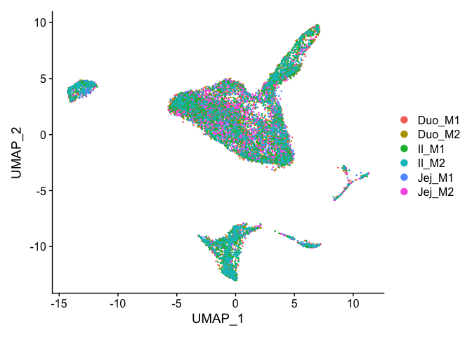
All batches are well mixed, maybe it is not very good since it is
possible that biological differences among Duo, Jej and Il are also
removed. In scRNA\_practice.ipynb (combat is used there for batch
correction), for example, Duo, Jej belong to Enterocyte (Proximal) and
Il belongs to Enterocyte (Distal).

Clustering. Here resolution is chosen as 0.2 which results in the same
number of clusters as that in scRNA\_practice.ipynb. But it leads to
different annotations as we can see below.

    ie.integrated <- FindNeighbors(ie.integrated, dims = 1:10)

    ## Computing nearest neighbor graph

    ## Computing SNN

    ie.integrated <- FindClusters(ie.integrated, resolution = 0.2)

    ## Modularity Optimizer version 1.3.0 by Ludo Waltman and Nees Jan van Eck
    ## 
    ## Number of nodes: 12445
    ## Number of edges: 437969
    ## 
    ## Running Louvain algorithm...
    ## Maximum modularity in 10 random starts: 0.9358
    ## Number of communities: 9
    ## Elapsed time: 1 seconds

    DimPlot(ie.integrated, reduction = "umap")

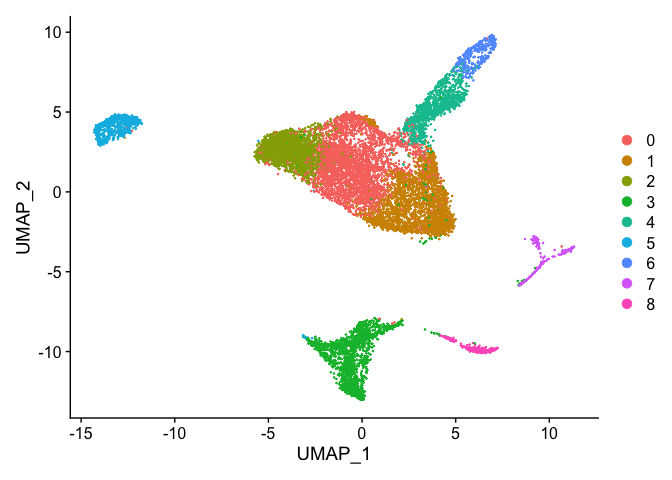

Find marker genes

    ie.integrated.markers <- FindAllMarkers(ie.integrated, only.pos = TRUE, min.pct = 0.2, logfc.threshold = 0.2)

    ## Calculating cluster 0

    ## Calculating cluster 1

    ## Calculating cluster 2

    ## Calculating cluster 3

    ## Calculating cluster 4

    ## Calculating cluster 5

    ## Calculating cluster 6

    ## Calculating cluster 7

    ## Calculating cluster 8

    ie.integrated.markers %>% group_by(cluster) %>% top_n(n = 10, wt = avg_logFC)

    ## Registered S3 method overwritten by 'cli':
    ##   method     from    
    ##   print.boxx spatstat

    ## # A tibble: 90 x 7
    ## # Groups:   cluster [9]
    ##        p_val avg_logFC pct.1 pct.2 p_val_adj cluster gene       
    ##        <dbl>     <dbl> <dbl> <dbl>     <dbl> <fct>   <chr>      
    ##  1 5.14e-196     0.473 0.831 0.739 1.03e-192 0       mm10-Mcm6  
    ##  2 6.31e-160     0.344 0.966 0.898 1.26e-156 0       mm10-Clca3b
    ##  3 1.43e-140     0.386 0.872 0.786 2.86e-137 0       mm10-Kcnn4 
    ##  4 4.80e-138     0.363 0.864 0.799 9.59e-135 0       mm10-Dut   
    ##  5 2.83e-121     0.327 0.854 0.751 5.65e-118 0       mm10-Siva1 
    ##  6 7.13e-114     0.355 0.768 0.679 1.43e-110 0       mm10-Mcm7  
    ##  7 5.16e-113     0.330 0.836 0.737 1.03e-109 0       mm10-Dmbt1 
    ##  8 4.44e-105     0.388 0.82  0.782 8.88e-102 0       mm10-Pcna  
    ##  9 6.71e- 78     0.324 0.752 0.696 1.34e- 74 0       mm10-Nasp  
    ## 10 2.72e- 71     0.326 0.641 0.549 5.44e- 68 0       mm10-Ung   
    ## # … with 80 more rows

Check early enterocyte marker Arg2

    VlnPlot(ie.integrated, features = c("mm10-Arg2"))

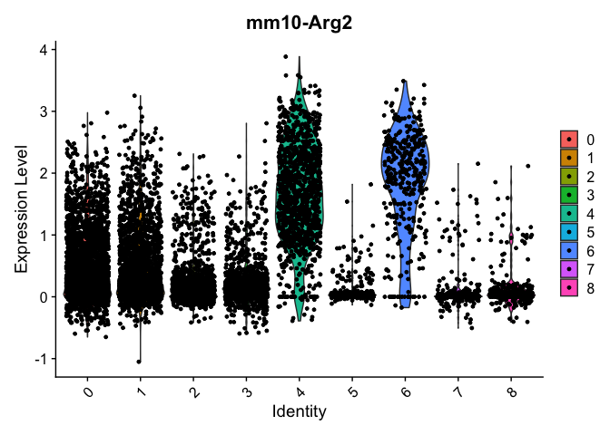
It looks both clusters 4 and 6 have high expression of Arg2.

    features.plot <- c("mm10-Arg2")
    FeaturePlot(object = ie.integrated, features = features.plot)

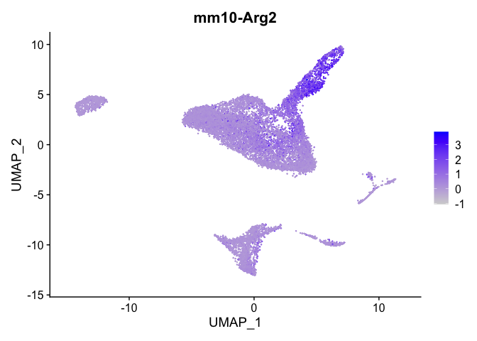

Check some other enterocyte markers.

    FeaturePlot(ie.integrated, features = c("mm10-Alpi", "mm10-Apoa1", "mm10-Apoa4", "mm10-Fabp1"))

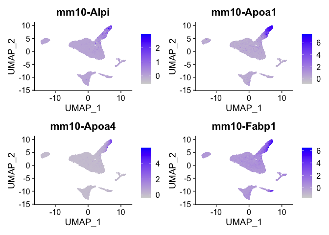
Compared with markers in scRNA\_practice.ipynb, clusters 4 and 6 should
be Enterocyte imm. and Enterocyte mature respectively.

    VlnPlot(ie.integrated, features = "percent.mt", pt.size=0)

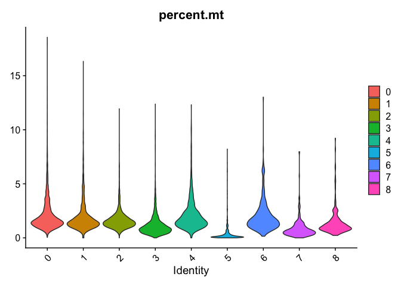

    FeaturePlot(ie.integrated, features = "percent.mt")

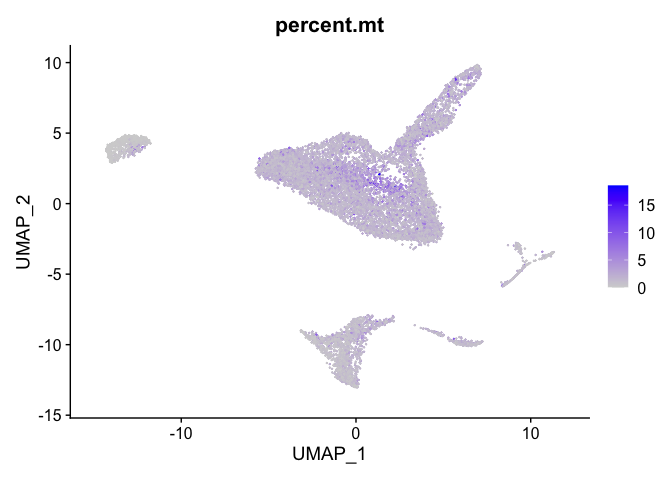
No clusters have obvious higher mitochondrial read fractions from violin
plot. From feature plot, cluster 0 has higher mitochondrial read
fractions than other clusters. Cluster 0 might be EP.

Check Stem markers.

    FeaturePlot(ie.integrated, features = c("mm10-Gkn3", "mm10-Ascl2", "mm10-Lgr5", "mm10-Olfm4", "mm10-Axin2", "mm10-Slc12a2"))

    ## Warning: Could not find mm10-Olfm4 in the default search locations, found in RNA
    ## assay instead

    ## Warning: Could not find mm10-Axin2 in the default search locations, found in RNA
    ## assay instead

    ## Warning: Could not find mm10-Slc12a2 in the default search locations, found in
    ## RNA assay instead

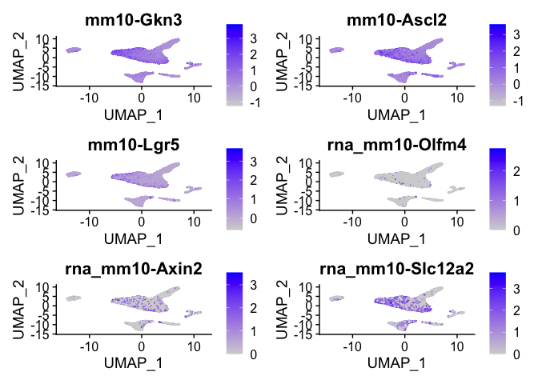
Cluster 2 is Stem.

Compared with marker genes in scRNA\_practice.ipynb, cluster 1 is TA,
cluster 3 is Goblet, cluster 5 is Paneth, cluster 7 is Enteroendocrine,
cluster 8 is Tuft.

Annotate clusters

    new.cluster.ids <- c("EP", "TA", "Stem", "Goblet", "Enterocyte imm.", "Paneth", "Enterocyte mature", "Enteroendocrine", "Tuft")
    names(new.cluster.ids) <- levels(ie.integrated)
    ie.integrated <- RenameIdents(ie.integrated, new.cluster.ids)
    DimPlot(ie.integrated, reduction = "umap", label = TRUE, pt.size = 0.5) + NoLegend()

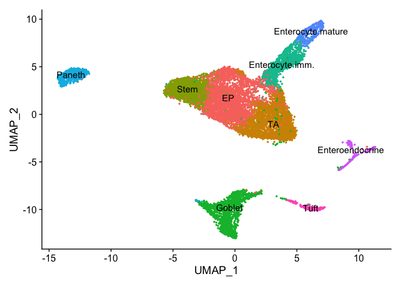
Here, different from scRNA\_practice.ipynb, after the first round of
clustering, EP belongs to one cluster while Enterocyte have two clusters
already.
